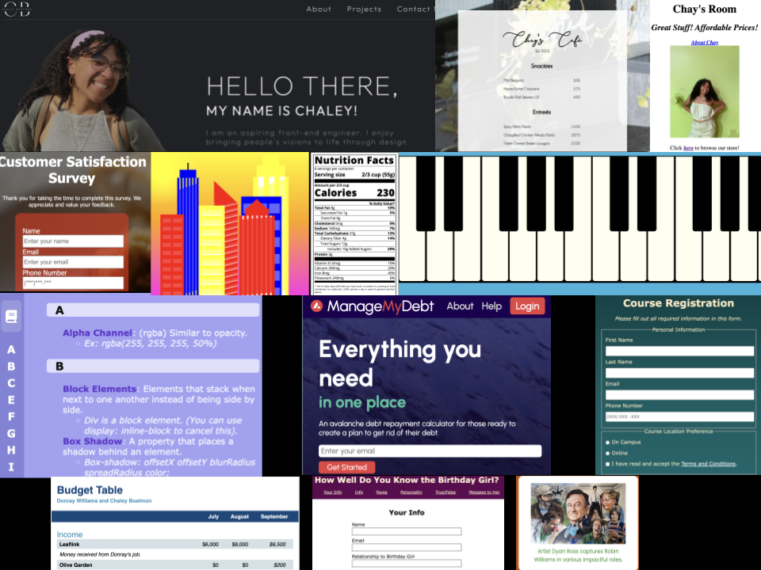

# My First Apps


This collection of projects represents my early journey into web development, inspired by the FreeCodeCamp curriculum. These projects showcase my initial grasp of HTML and CSS, and they include both FreeCodeCamp certification projects and additional practice projects that I created independently.


## Features

- **Certification Projects**: Explore projects completed as part of the FreeCodeCamp curriculum, each marking a significant milestone in my coding journey.
- **Extra Practice**: Discover additional projects created independently to reinforce my HTML and CSS skills, showcasing my dedication to continuous learning.

## Getting Started

To view these projects, you can clone this repository:

```bash
git clone git@github.com:chayboats/my-first-apps.git
```
Feel free to navigate through the folders to explore the individual projects.

## Technology Used
- HTML
- CSS
  
## Acknowledgements
I want to express my gratitude to FreeCodeCamp for providing an excellent platform for learning web development and helping me build a strong foundation.

## Contact Me
If you have any questions, comments, or suggestions, please don't hesitate to reach out. I'd love to hear from you!

**Chaley Boatmon**
- Email: **<u>chaleyboatmon@gmail.com</u>**
- GitHub: [<u>**chayboats**</u>](https://github.com/chayboats)

Thank you for visiting my repository!
